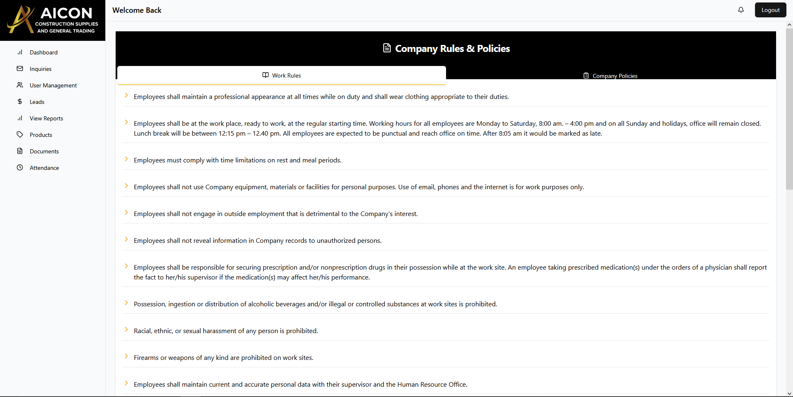
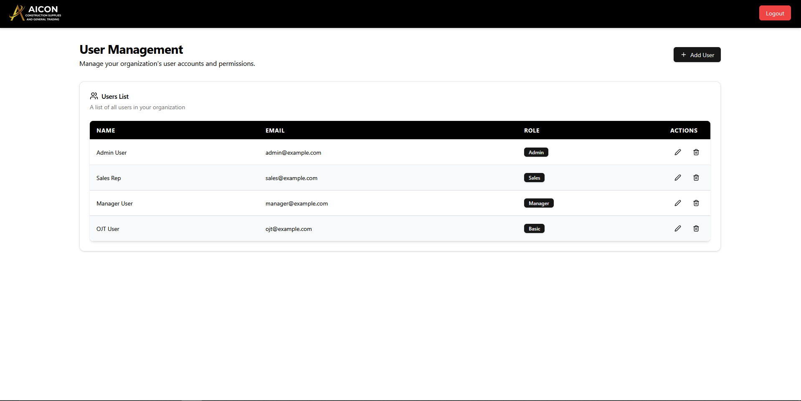
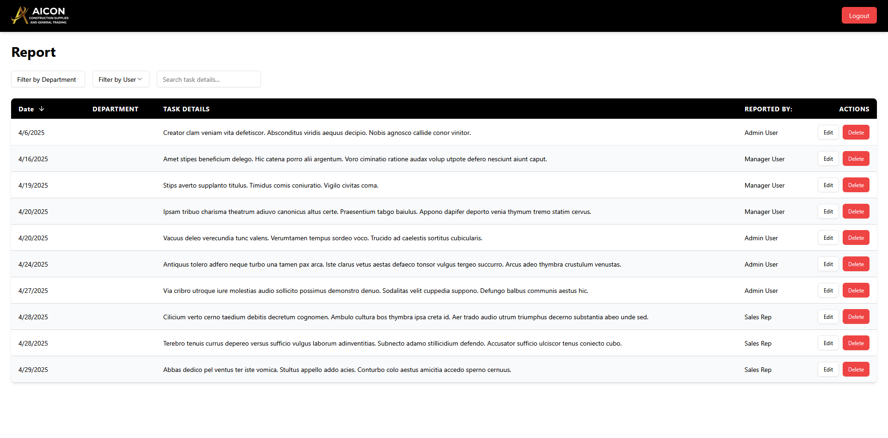
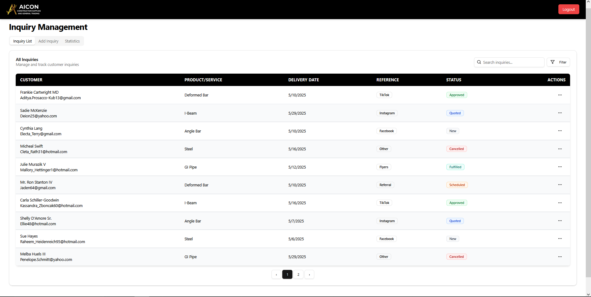
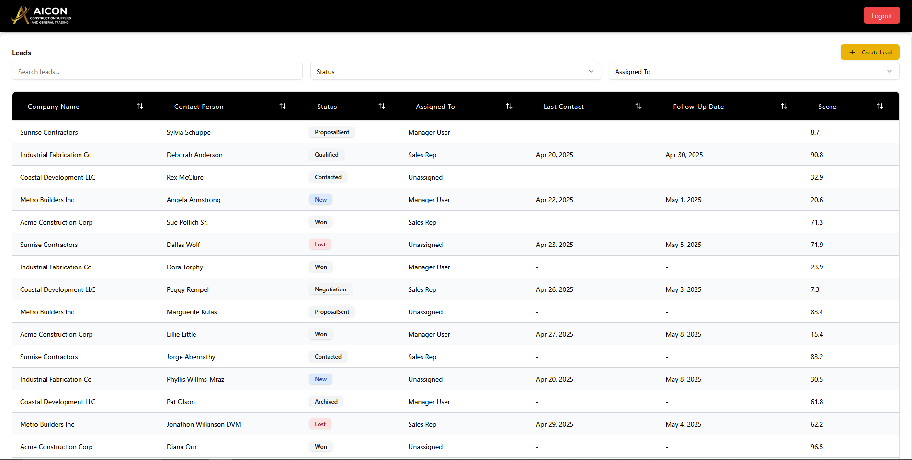
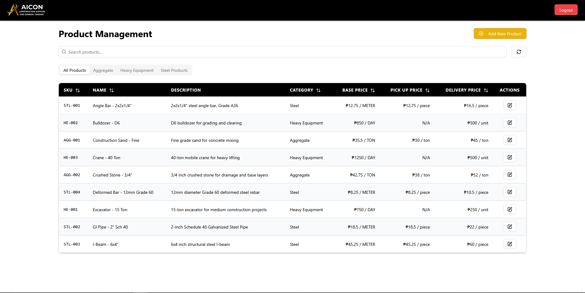
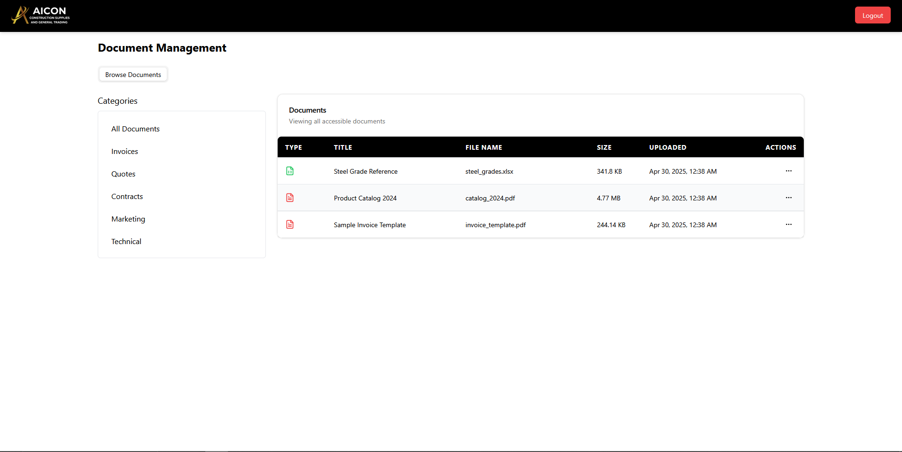
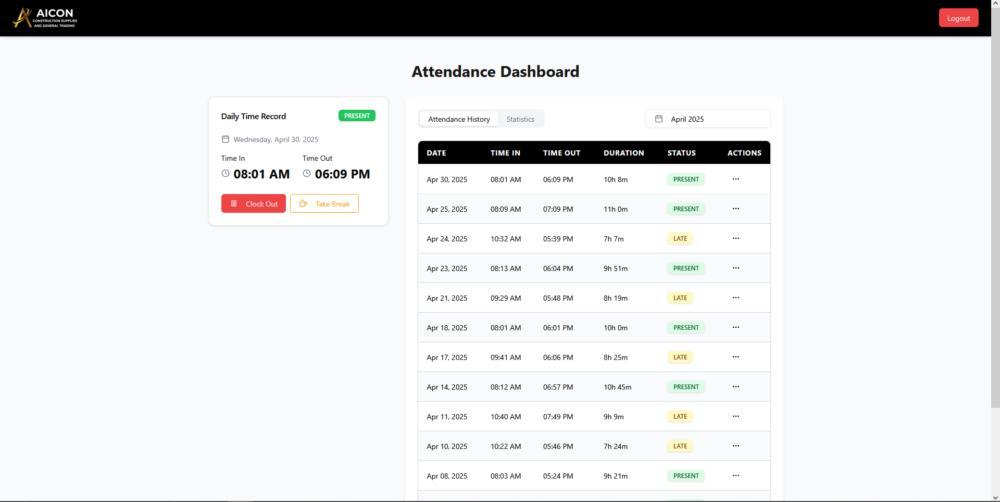

# Internal Control Panel

## Overview

This project is an internal control panel designed to serve as a central hub for CRM and internal tooling. It provides staff and administrators with tools to manage various aspects of the business operations efficiently.

## Features

The control panel currently includes the following core modules:

* **User Management:** Manage internal user credentials and role.
* **Reports:** Daily log report.
* **Product Catalog:** Manage the company's product listings.
* **Document Repository:** Store and organize important company documents.
* **Attendance:** Track employee attendance.
* **Leads:** Manage potential customer leads.
* **Inquiries:** Track customer or external inquiries.

## Screenshots

**Dashboard / Main View:**

**User Management:**

**Reports View:**

**Inquiries View:**

**Leads View:**

**Products View:**

**Documents View:**

**Attendance View:**

## Target Audience

This application is intended for **internal staff and administrators** only.

## Tech Stack

* **Frontend:**
    * React
    * Tailwind CSS
    * shadcn/ui
    * Vite (Build Tool)
    * React Query
    * Redux
* **Backend:**
    * Node.js with Express
    * Prisma (ORM)
    * TypeScript
    * Supabase (for storage)
    * Passport-Local (for authentication)

## Getting Started (Local Development)

This project uses separate repositories/folders for the frontend and backend.

1.  **Clone Repositories:** Ensure you have cloned both the frontend and backend repositories.
2.  **Navigate to Directories:** Open two separate terminal windows or VS Code instances.
    * In the first, navigate to the `frontend` project root.
    * In the second, navigate to the `backend` project root.
3.  **Install Dependencies:** Run `npm install` (or `yarn install`) in *both* the `frontend` and `backend` directories.
4.  **Set Up Environment Variables:**
    * Create a `.env` file in the `frontend` directory and add the `VITE_API_URL` variable.
    * Create a `.env` file in the `backend` directory and add all the required backend variables listed above. Obtain the necessary keys and connection strings.
5.  **Database Setup (Backend):**
    * Ensure your database server (e.g., PostgreSQL, MySQL) is running.
    * Run Prisma migrations to set up the database schema: `npx prisma migrate dev --name init` (or appropriate migration command).
6.  **Run Development Servers:**
    * In the `backend` terminal, run: `npm run dev`
    * In the `frontend` terminal, run: `npm run dev`
7.  **Seed Database:**
    * In the `backend` terminal, run `npx ts-node prisma/seed.ts`
8.  **Access Application:** Open your browser and navigate to the URL provided by the Vite development server (usually `http://localhost:5173` or similar).

## Deployment

The frontend application is currently deployed and accessible at:
[https://aicon-control-panel.netlify.app/](https://aicon-control-panel.netlify.app/)

The backend is deployed on Render

## Maintenance

* **Maintainer:** Currently maintained solely by John Lorenz Inocentes.

